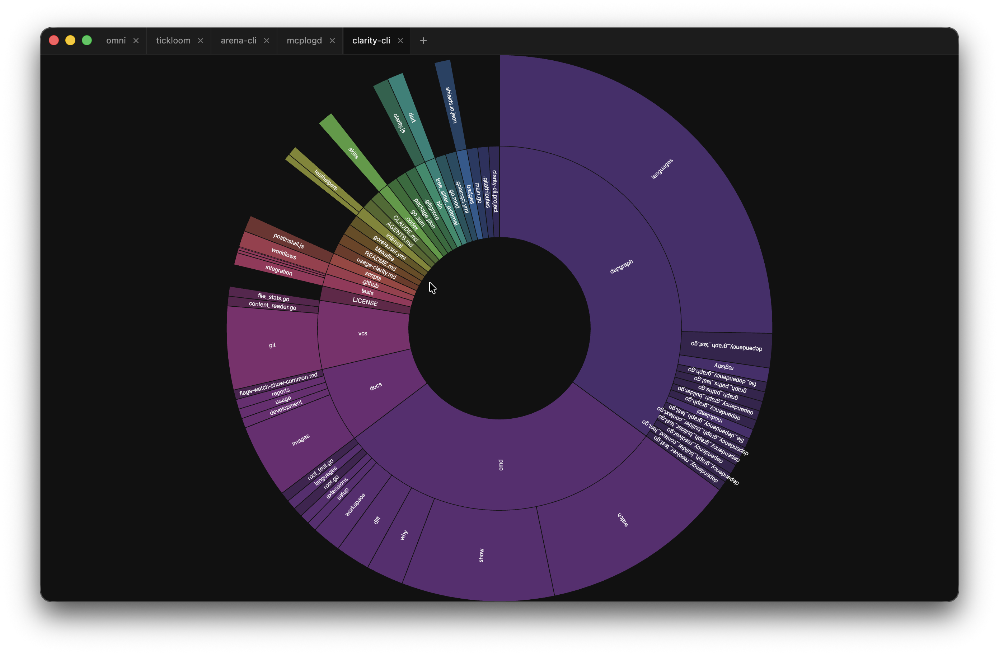

# Terrain

[](https://github.com/LegacyCodeHQ/clarity-cli)
[](LICENSE)
[](#)



Terrain is a macOS Electron + React + TypeScript desktop app that renders a zoomable [d3 sunburst](https://observablehq.com/@d3/zoomable-sunburst) of a git repository's directory structure, sized by lines of code. It helps developers get a feel for the shape of an unfamiliar codebase before opening it in an IDE.

## Features

- Zoomable, animated sunburst sized by LOC (newline scan, `.gitattributes`-aware).
- Multi-tab UI — open multiple repositories side by side.
- Session restore — open tabs, active tab, and per-tab zoom focus persist across launches.
- Native folder picker, native error dialogs, hidden-inset titlebar.

## Build And Test

```sh
npm run start          # Dev mode (electron-forge + vite HMR)
npm run lint           # biome check src/
npm run lint:fix       # biome check --write src/
npm test               # All tests (jest)
npm run test:main      # Main process tests only
npm run test:renderer  # Renderer process tests only
npm run package        # Build unsigned .app
```

Single test: `npx jest --testPathPattern=<pattern>`

## Architecture

- **Main** (`src/main/`) — app lifecycle, native dialogs, IPC handlers that shell out to `git` (`rev-parse`, `ls-files`, `check-attr`) and read tracked files for line counts.
- **Renderer** (`src/renderer/`) — React SPA. Owns the sunburst (D3 v7), empty state, tab bar, breadcrumb, and tooltip.
- **Shared** (`src/shared/`) — IPC channel constants and the `TreeNode` data shape consumed by the sunburst.

The renderer never touches the filesystem directly; everything external routes through IPC.

Session state lives at `~/Library/Application Support/Terrain/session.json` — a list of open `repoPath`s (plus optional `focusPath` per tab) and an active index. On launch, paths are silently dropped if they no longer point to a git repo.

See [PRD.md](PRD.md) for the v1 product spec, scope, and acceptance criteria, and [AGENTS.md](AGENTS.md) for guidance when working on the codebase.

## License

This project is licensed under the [Apache License, Version 2.0](LICENSE).

Copyright © 2026-present, Legacy Code Headquarters (OPC) Private Limited.
